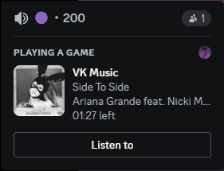

# VKRichPresence

## About
***
Application gives chance to show music from your status VK.
##### Profile
That you have playing activity with state as artist,  
details as title of track and main name as VK Music.  

##### Room
That you have playing activity with state as artist,  
details as title of track and main name as VK Music.  
Also you have a button with url on track for other people.  

## Installation 
***
This bot runs on [Python](https://www.python.org/). You will need at least python 3.10.

### Windows

1. Install [Python](https://www.python.org/)
2. Activate venv in console `python -m venv venv`
3. Install all needed packages `pip install -r requirements.txt`.
4. Configurate `.env` (Add your token).
5. Run `python main.py` to start bot.

